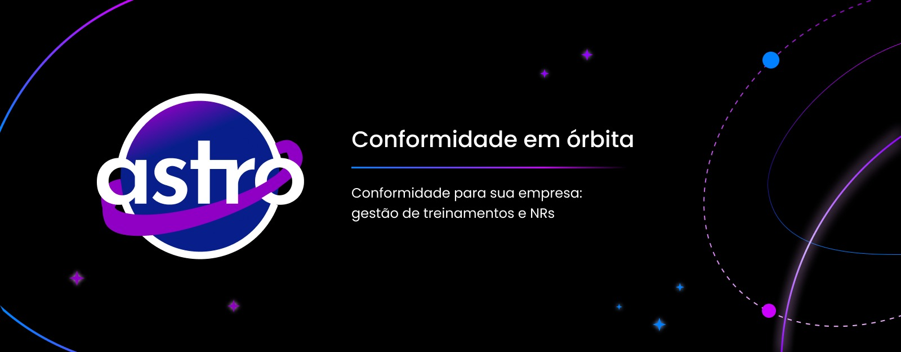

  

  <b>Conformidade em órbita.</b>

  
  
  
  
  
  
  
  
  
  
  
  
  
  
  
  
  
  
  
  
  
  
  
  

  <a href="#-sobre">Sobre</a> •
  <a href="#-o-problema">Problema</a> •
  <a href="#-a-solução">Solução</a> •
  <a href="#-funcionalidades">Funcionalidades</a> •
  <a href="#-arquitetura">Arquitetura</a> •
  <a href="#-tecnologias">Tecnologias</a> •
  <a href="#-como-executar">Como Executar</a> •
  <a href="#-equipe">Equipe</a>

---

## Sobre

O **ASTRO** é uma plataforma inteligente voltada para a gestão de conformidade com as **Normas Regulamentadoras (NRs)**, auxiliando empresas na organização de treinamentos obrigatórios, monitoramento da validade de certificados e acompanhamento das exigências legais relacionadas à Saúde e Segurança do Trabalho (SST).

A plataforma foi criada para reduzir processos manuais, centralizar informações e utilizar Inteligência Artificial para apoiar empresas na tomada de decisões relacionadas à conformidade legal.

---

## O Problema

Grande parte das empresas ainda realiza o gerenciamento das Normas Regulamentadoras utilizando planilhas, documentos físicos ou controles descentralizados.

Isso gera diversos desafios:

- Dificuldade para identificar quais NRs se aplicam à empresa
- Controle manual e suscetível a erros de treinamentos e reciclagens
- Certificados vencidos sem monitoramento adequado
- Risco de multas e autuações por parte da fiscalização
- Sobrecarga operacional para as equipes de RH e SST
- Informações descentralizadas em múltiplos sistemas
- Dificuldade para acompanhar alterações e atualizações nas normas

---

## A Solução

O ASTRO centraliza todas essas informações em uma única plataforma, automatizando processos e oferecendo recursos inteligentes para apoiar empresas na gestão da conformidade.

A plataforma permite acompanhar treinamentos, certificados, pendências e atualizações das NRs de forma organizada, reduzindo erros e aumentando a eficiência operacional das equipes de SST e RH.

---

## Funcionalidades

<table>
  <thead>
    <tr>
      <th>Funcionalidade</th>
      <th>Descrição</th>
      <th>Status</th>
    </tr>
  </thead>
  <tbody>
  </tbody>
</table>

---

## Interface

  
  

  
  

---

## Tecnologias

<table>
  <thead>
    <tr>
      <th>Categoria</th>
      <th>Tecnologia</th>
      <th>Finalidade</th>
    </tr>
  </thead>
  <tbody>
    <tr>
      <td>Front-end</td>
      <td>HTML · CSS · JavaScript · TypeScript · React</td>
      <td>Interface web da plataforma</td>
    </tr>
    <tr>
      <td>Back-end</td>
      <td>FastAPI · Spring Boot</td>
      <td>APIs e regras de negócio</td>
    </tr>
    <tr>
      <td>Banco de Dados</td>
      <td>PostgreSQL · MongoDB · Redis · Neo4j</td>
      <td>Persistência e cache de dados</td>
    </tr>
    <tr>
      <td>Inteligência Artificial</td>
      <td>Google Gemini · Groq · LangChain · LangSmith · LangGraph</td>
      <td>Assistente inteligente e automações</td>
    </tr>
    <tr>
      <td>Mobile</td>
      <td>Android</td>
      <td>Aplicativo mobile</td>
    </tr>
    <tr>
      <td>DevOps</td>
      <td>Docker · Git · GitHub</td>
      <td>Containerização e versionamento</td>
    </tr>
    <tr>
      <td>Design & Gestão</td>
      <td>Figma · Jira</td>
      <td>Prototipação e gestão ágil</td>
    </tr>
  </tbody>
</table>

---

## Equipe

<table>
  <thead>
    <tr>
      <th>Nome</th>
      <th>Função</th>
      <th>GitHub</th>
    </tr>
  </thead>
  <tbody>
    <tr>
      <td>Felipe Battalhini Boregio</td>
      <td>Back-end</td>
      <td><a href="https://github.com/Lipe-to">@Lipe-to</a></td>
    </tr>
    <tr>
      <td>Igor Quinto</td>
      <td>Front-end</td>
      <td><a href="https://github.com/IgorQuinto5">@IgorQuinto5</a></td>
    </tr>
    <tr>
      <td>Lucas Lima De Oliveira</td>
      <td>Dados</td>
      <td><a href="https://github.com/lucaslimaoliveira">@lucaslimaoliveira</a></td>
    </tr>
    <tr>
      <td>Luiza Cursino De Vicente</td>
      <td>Dados</td>
      <td><a href="https://github.com/LuizaDeVicente">@LuizaDeVicente</a></td>
    </tr>
    <tr>
      <td>Maria Eduarda Araujo Gonçalves Rosa</td>
      <td>Back-end</td>
      <td><a href="https://github.com/rosamaduda">@rosamaduda</a></td>
    </tr>
    <tr>
      <td>Tainá Dias Martinelli</td>
      <td>Front-end</td>
      <td><a href="https://github.com/Taina14m">@Taina14m</a></td>
    </tr>
  </tbody>
</table>

---

## Licença

Este projeto encontra-se em desenvolvimento. A definição da licença será realizada nas versões futuras do sistema.